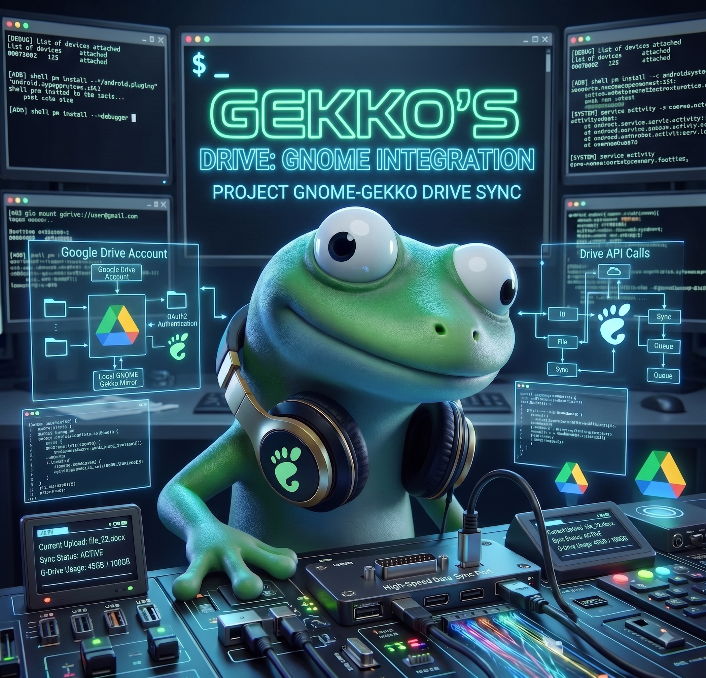

<div align="center">

 

<sub><i>(Imagen generada con Gemini — modelo Nano Banana)</i></sub>

# Drive-Gekko-Gnome

**Google Drive en Nautilus, sobre Arch Linux, después de que Arch lo retirara**

<sub>`libsoup2` · `libgdata` · `gvfs-google` · `gnome-online-accounts` — construidos desde el código oficial de GNOME</sub>

<br>


</div>

---

> [!WARNING]
> **Lee esto antes de instalar.** Google Drive en GNOME está muerto upstream:
> GNOME archivó `libgdata`, gvfs marcó su backend de Google como *deprecated* y
> Arch lo eliminó de sus repos en 2026. Este repo lo revive, pero implica
> cargar con **libsoup 2.4, una librería HTTP sin releases upstream**.
> Si lo único que quieres son tus archivos o un backup, **[rclone](https://rclone.org/)
> está en `[extra]`, tiene upstream vivo y lo hace sin esa deuda.**
> La comparación honesta está en **[docs/estado-upstream.md](docs/estado-upstream.md)**.

## Instalación

**Necesitas:** Arch Linux con GNOME, un usuario con `sudo`, conexión a internet
y unos 10 minutos de compilación. «Con GNOME» no es una receta: si montaste el
escritorio a mano puede faltarte alguna de estas piezas, así que instálalas
antes. Si tienes el paquete `libsoup` (2.4) del AUR, el script te pedirá
quitarlo: `libsoup2` lo sustituye.

```bash
sudo pacman -S --needed base-devel git gvfs gvfs-goa gnome-control-center gnome-keyring
git clone https://github.com/The-Gekko/Drive-Gekko-Gnome.git
cd Drive-Gekko-Gnome
./install.sh
```

`gnome-keyring` está en esa lista por un motivo que no se ve: es quien aporta
`org.freedesktop.secrets`, y en Arch **nadie lo arrastra como dependencia**, ni
siquiera `gnome-session`. Sin él la cadena se instala y verifica entera, y aun
así la cuenta de Google no se puede dar de alta
([abajo](#el-paso-que-no-puede-hacer-el-script)).

Los binarios no se publican en GitHub: **cada máquina los construye** a partir
de las recetas de este repo. `install.sh`:

1. actualiza el sistema e instala las herramientas de compilación (`pacman -Syu`, tú confirmas)
2. construye los cuatro paquetes en orden y los deja en un **repositorio de pacman local** (`out/`)
3. pone ese repositorio en `/etc/pacman.conf`, **antes** de `[core]` (abajo el porqué)
4. instala `gvfs-google` y `gnome-online-accounts` desde ahí con `pacman -Syu` (tú confirmas)
5. **verifica** que el resultado sirve: que `gvfsd-google` enlaza y que GOA pide
   el permiso de Drive (y avisa si falta el llavero, que no lo construye este repo)
6. deja puestos el **temporizador** (`drive-gekko-repo.timer`, cada 6 h: `git pull` y,
   si el bot cambió alguna receta, reconstruir), el hook de pacman y el servicio de
   inicio de sesión. El hook va el último a propósito: armado antes, cualquier
   `pacman -S` que hicieras para desatascar una instalación a medias dispararía
   avisos críticos sobre una cadena que todavía no existe

> [!NOTE]
> **Qué se instala solo y qué no.** El paso 1 pone las herramientas
> (`base-devel git glib2-devel gobject-introspection meson ninja vala gcr`) y el
> paso 2 instala además los `makedepends` que declara cada receta, leyéndolos
> de su `.SRCINFO` — hoy 28 paquetes: `gcr`, `gcr-4`, `libgoa`, `gtk4`,
> `libadwaita`, `krb5`, `libxslt`… Lo que **nunca** se instala solo son los
> `depends`: la construcción usa `makepkg -d`. Así que si un build para con
> `ERROR: Dependency 'X' not found`, falta el paquete que provee ese `.pc`:
> localízalo (`sudo pacman -Fy` una vez, después `pacman -F X.pc`), instálalo y
> vuelve a lanzar `./install.sh`.

A partir de ahí, **`sudo pacman -Syu` instala las actualizaciones** que el
temporizador haya construido, en la misma transacción que el `gvfs` o `libgoa`
nuevo de Arch.

> [!NOTE]
> El repo es público: ni el `git clone` ni el `git pull` del temporizador
> necesitan credencial. Si vienes de una instalación anterior y guardaste un
> token en `/etc/drive-gekko-gnome.token`, ya no sirve para nada:
> `sudo rm /etc/drive-gekko-gnome.token`.

### Si usas `gekko`

Con [`gekko`](https://github.com/The-Gekko) instalado en el sistema
(`/usr/local/bin/gekko`), las notificaciones de este proyecto dejan de mandarte
a la documentación y nombran un solo comando:

```bash
gekko drive        # estado, reconstruir e instalar, recolocar el repo, ver el registro
gekko drive u      # reconstruir e instalar, sin menú
```

En el menú de `gekko` aparece **Google Drive (GNOME)** cuando este proyecto está
instalado, y una entrada extra **⚠ Reactivar Google Drive** solo cuando hay algo
que arreglar.

<details>
<summary>Solo el bloque de pacman.conf, a mano</summary>

```ini
# ANTES de [core] y [extra]
[drive-gekko-gnome]
SigLevel = Optional TrustAll
Server = file:///ruta/al/clon/Drive-Gekko-Gnome/out
```

(con los espacios de la ruta como `%20`; `scripts/add-repo.sh --local <ruta>/out`
lo escribe bien, lo recoloca si estaba en mal sitio y comprueba antes que pacman
puede leerlo)

**Por qué «que pacman puede leerlo» no sobra:** pacman no lee los repositorios
como root, sino como el usuario de `DownloadUser` (de fábrica `alpm`), y lo hace
también con los `file://`. Si el clon cuelga de un HOME con el `0700` de
fábrica, ese usuario no puede ni atravesarlo, y entonces falla **todo**
`pacman -Sy` de la máquina, no solo lo de Drive. `add-repo.sh` lo comprueba
ejecutando como ese usuario y, si hace falta, le concede lo mínimo con ACL:
paso (`--x`) en cada directorio del camino y lectura (`r-X`) sobre `out/`. Si
no lo consigue **no escribe el bloque** y sale con error: mejor eso que dejar
pacman inservible.

**Por qué antes de `[core]`:** `gnome-online-accounts` existe en `[extra]`, y
pacman elige el *primer* repositorio de `pacman.conf` que tenga un paquete con
ese nombre, sin mirar versiones. Si este repo va después, pacman instalará
siempre el GOA de Arch (sin permiso de Drive) y no dirá nada.
</details>

### El paso que no puede hacer el script

Cuando termine, **tienes que volver a autorizar tu cuenta de Google a mano**:

1. Abre `gnome-control-center online-accounts`
2. Si ya tenías una cuenta de Google, **quítala** y vuelve a añadirla
3. Acepta el permiso de Drive en la pantalla de consentimiento de Google
4. Comprueba que en la cuenta aparece el servicio **Archivos** activado

Este paso **no es opcional y no se puede saltar**. El token que Google te dio
antes se firmó sin el permiso de Drive, y Google no lo amplía de forma
retroactiva. Sin reautorizar, Nautilus dará *«Permiso denegado»* aunque todo lo
demás esté perfecto.

Y hace falta un **llavero** en la sesión: GOA guarda el token con libsecret
contra `org.freedesktop.secrets`, que en Arch aporta `gnome-keyring` y que nadie
instala por ti. Si no hay ninguno, el consentimiento de Google termina en
*«Failed to store credentials in the keyring»* y la cuenta **no llega a
crearse**, con los cuatro paquetes instalados y todo lo demás diciendo
«operativo». `verify-chain.sh` lo avisa y el hook de pacman lo grita; el arreglo
es `sudo pacman -S --needed gnome-keyring` y volver a añadir la cuenta.

### Comprobar que funciona

```bash
ls /run/user/$(id -u)/gvfs/
```

Deberías ver un directorio `google-drive:host=gmail.com,user=TU_USUARIO`, y tu
unidad en la barra lateral de Nautilus. Al añadir la cuenta, GOA la monta solo;
si además ejecutas `gio mount "google-drive://TU_CORREO@gmail.com/"` y te dice
*«La ubicación ya está montada»*, eso es la confirmación, no un error.

Y las dos comprobaciones de fondo, por si algo falla:

```bash
ldd /usr/lib/gvfsd-google | grep 'not found'                 # debe salir vacío
strings /usr/lib/libgoa-backend-1.0.so | grep auth/drive     # debe salir algo
```

## Qué instala y por qué

Cuatro piezas. Las tres primeras son la cadena de archivos; la cuarta es la que
pide el permiso, y **sin ella las otras tres no sirven de nada**.

| Paquete | Estado en Arch | Qué aporta |
| --- | --- | --- |
| [`libsoup2`](packages/libsoup2/PKGBUILD) | retirado de `[extra]` en mayo 2026 | La librería HTTP 2.4 que necesita `libgdata`. **Con los 17 commits de la rama de mantenimiento que Arch recoge, 9 de ellos de seguridad** |
| [`libgdata`](packages/libgdata/PKGBUILD) | retirado de `[extra]` en mayo 2026 | El protocolo GData de Google. Archivado upstream |
| [`gvfs-google`](packages/gvfs-google/PKGBUILD) | **no existe en ningún sitio** | `gvfsd-google`: el backend que monta la unidad |
| [`gnome-online-accounts`](packages/gnome-online-accounts/PKGBUILD) | está en `[extra]`, pero **compilado sin Drive** | El mismo paquete de Arch recompilado con `-D google_files=true` |

### La pieza que casi nadie ve

Instalar `gvfsd-google` no basta. En febrero de 2026 GNOME movió el soporte de
Drive de GOA detrás de una opción de compilación, apagada por defecto:

```meson
option('google_files', type: 'boolean', value: false,
       description: 'Enable Google provider Files feature')
```

Arch compila con el valor por defecto. Resultado: el `goa-daemon` de `[extra]`
nunca pide `https://www.googleapis.com/auth/drive`, la cuenta no expone la
interfaz `org.gnome.OnlineAccounts.Files`, y `gvfsd-google` recibe *«Permiso
denegado»* aunque esté perfectamente instalado. Se puede verificar:

```bash
strings /usr/lib/libgoa-backend-1.0.so | grep googleapis.com/auth/
```

Por eso este repo recompila GOA. La idea no es nuestra: es lo que hace Solus
desde el 21 de marzo de 2026 (ver [Créditos](#créditos)). Es la única de las
cuatro que **sustituye a un paquete oficial de Arch**, y eso tiene
consecuencias — ver abajo.

## Cómo se mantiene solo

Dos piezas, cada una en su sitio:

**En GitHub, un bot** (`.github/workflows/sync-upstream.yml`) mira cada 8 horas
si Arch movió `gvfs` o `gnome-online-accounts`, si GNOME publicó un `libsoup`
2.74.x nuevo, si Arch amplió sus parches, y si Solus cambió los flags que nos
importan. Cuando hay un cambio, **construye, instala y verifica la cadena entera
en un contenedor de Arch limpio** antes de tocar nada. La regla:

> **Si Arch sube el último número de gvfs o cualquier cosa de GOA dentro de la
> misma serie, el bot lo aplica solo en `main`. Si cambia de serie, si es
> libsoup2 o libgdata, abre un PR y el propietario pulsa Merge. Si Solus toca
> sus flags o algo no se puede leer, abre un issue y no bloquea lo demás.**

Ese build usa `build-all.sh` (`makepkg --syncdeps`, que instala también los
`depends`), que **no** es el camino de tu máquina. El que sí lo es —
`local-repo.sh`, solo `makedepends` y `makepkg -d` — lo recorre un job aparte de
`build.yml`, en un contenedor pelado y sin preparar: es el que caza que a una
receta le falte declarar una dependencia de compilación, que es exactamente lo
que un CI en verde por el otro camino no demuestra.

**En tu máquina, un temporizador** (`drive-gekko-repo.timer`, cada 6 h) hace
`git pull` y, solo si cambió alguna receta, reconstruye los paquetes y actualiza
el repositorio local. **Tú instalas con `sudo pacman -Syu`**, cuando quieras,
viendo la transacción: `gvfs-google` y `gnome-online-accounts` entran junto con
el `gvfs`/`libgoa` nuevo de Arch, sin actualizaciones parciales.

Por qué cada paquete sigue a quien sigue (y por qué *ninguno* sigue las
versiones de Solus), qué pasa en cada caso y qué puede fallar:
[docs/automatizacion.md](docs/automatizacion.md).

## Qué se rompe y cuándo (la última red)

| Qué pasa | Cómo te enteras | Qué hacer |
| --- | --- | --- |
| Arch actualiza `gvfs` o `gnome-online-accounts` y tu repositorio local aún no tiene la receta nueva construida | `pacman -Syu` **se planta** con un conflicto de dependencias (el pin funcionando, a propósito) | `sudo systemctl start drive-gekko-repo.service` (trae y construye) y repetir `pacman -Syu`. Si el bot aún no subió la receta: esperar (≤ 8 h) o *Actions → sync-upstream → Run workflow* |
| Alguien pone el repo después de `[extra]`, o instala el GOA de Arch a mano | El hook de pacman lo grita al terminar la transacción y llega una notificación | `sudo scripts/add-repo.sh --local <repo>/out` lo recoloca; `sudo pacman -Syu` |
| El temporizador no puede hacer `git pull` | Notificación: «fallo al actualizar» y `journalctl -u drive-gekko-repo` | El repo es público, así que suele ser red, o un clon con el remoto en `ssh`: `git -C <clon> remote -v` debe apuntar al `https` |
| Mueves o renombras el clon | **Todo** `pacman -Sy` falla («no se pudo obtener el archivo `drive-gekko-gnome.db`»); el aviso de inicio de sesión lo dice en rojo | Hay que corregir **dos** sitios: `sudo <clon>/scripts/add-repo.sh --local <clon>/out` y `REPO=` en `/etc/drive-gekko-gnome.conf` |
| GNOME borra la opción `google` de gvfs | El bot abre un issue; `./scripts/check-updates.sh` lo avisa | Fin del camino: quedarte en la versión actual o migrar a rclone |

El caso peligroso es el segundo, porque **no da ningún error**: Drive
simplemente deja de montar. Por eso `install.sh` deja dos avisos puestos:

| Dónde | Cuándo salta |
| --- | --- |
| `/etc/pacman.d/hooks/99-drive-gekko-gnome.hook` | Justo al terminar cualquier `pacman` que toque `gnome-online-accounts`, `gvfs`, `gvfs-google` o `gnome-keyring`. Escribe en la terminal **y lanza una notificación de escritorio** |
| `~/.config/systemd/user/drive-gekko-check.service` | En cada inicio de sesión, por si la actualización pasó cuando no estabas mirando |

Los dos ejecutan la misma comprobación (`post-upgrade-check.sh`): que el binario
instalado sigue pidiendo el permiso, que `gvfsd-google` sigue enlazando, que el
pin de `gvfs` sigue coincidiendo con lo instalado, que hay llavero, y que el
repositorio local sigue en `pacman.conf`, delante de `[extra]` y apuntando a un
sitio que existe. La primera, a mano:

```bash
strings /usr/lib/libgoa-backend-1.0.so | grep googleapis.com/auth/drive
```

No arreglan nada solos — construir paquetes no se hace dentro de una
transacción de pacman — pero hacen imposible no enterarse. Por lo mismo, el
hook **termina siempre con 0** aunque encuentre la cadena rota: un hook que
devuelve error solo consigue que pacman remate cada actualización con *«command
failed to execute correctly»*, que no explica nada. El aviso va por la terminal
y por notificación. (Con `ESTRICTO=1` en el entorno sí devuelve 1; eso es para
el CI, que lo usa como comprobación de verdad.)

También puedes preguntarlo tú en cualquier momento:

```bash
./scripts/check-updates.sh
```

> [!NOTE]
> **¿Y no se puede fijar para que no se quite nunca?** Se puede (`IgnorePkg`, o
> un `epoch` en el PKGBUILD), pero es mala idea: dejarías de recibir
> actualizaciones de seguridad de un paquete que guarda tus credenciales de
> Google, y sin enterarte. Es preferible que Arch gane y que la rotura sea
> ruidosa. Detalles en [docs/mantenimiento.md](docs/mantenimiento.md).

## Herramientas

| Script | Para qué |
| --- | --- |
| `./install.sh` | Todo lo anterior de una vez |
| `sudo scripts/local-repo.sh` | Lo que hace el temporizador: `git pull`, construir si cambió algo (o si a `out/` le falta un paquete), repo local. `--dry-run`, sin `sudo`, para ver el plan |
| `./scripts/add-repo.sh --local DIR` | El bloque de `pacman.conf`, en el sitio correcto (y lo recoloca si está mal). Antes de escribirlo, comprueba que el `DownloadUser` de pacman llega a `DIR` y le da acceso con ACL si no |
| `./scripts/publish-repo.sh --check` | Genera `out/drive-gekko-gnome.db` (lista blanca de 4) y prueba que pacman la lee, incluido que el `DownloadUser` llega hasta ella |
| `./scripts/sync-upstream.sh` | Lo que hace el bot, en tu máquina: sin `--apply` solo informa |
| `./scripts/verify-chain.sh` | ¿La cadena instalada sirve? ldd, pin, scope, libsoup 2.4 y llavero (esto último solo avisa) |
| `./scripts/ci-prepare.sh` | Prepara el contenedor de Arch del CI (lo usan los dos workflows) |
| `./scripts/check-updates.sh` | Versiones, el pin de gvfs, el estado de la opción `google` y si GOA sigue pidiendo el permiso de Drive |
| `./scripts/check-sources.sh` | De qué repo puede salir hoy cada paquete: oficiales, AUR o Chaotic |
| `./scripts/build-all.sh` | Construir la cadena por partes. Lo que no es de la cadena (`--with-optional`) va a `out-opcional/`, fuera del repo local |
| `./scripts/lint.sh` | `bash -n` + `namcap` sobre los PKGBUILD |

## De dónde sale el código

Siempre del tarball o el tag oficial de GNOME, con checksum fijado. Los
tarballs se contrastan contra el `.sha256sum` que publica `download.gnome.org`;
los checkouts git, contra el `b2sum` que verifica el PKGBUILD oficial de Arch
para el mismo tag.

| Paquete | Fuente | Verificación |
| --- | --- | --- |
| `libsoup2` | `git+gitlab.gnome.org/GNOME/libsoup.git#tag=2.74.3` | `b2sums` del checkout, el mismo valor que verifica Arch |
| `libgdata` | `download.gnome.org/.../libgdata-0.18.1.tar.xz` | `sha256sums` |
| `gvfs-google` | `download.gnome.org/.../gvfs-1.60.2.tar.xz` | `sha256sums` |
| `gnome-online-accounts` | `git+gitlab.gnome.org/GNOME/gnome-online-accounts.git#tag=3.58.1` | `b2sums` |

Los parches de `libsoup2` se toman del paquete oficial de Arch
(`git cherry-pick` sobre la rama de mantenimiento `libsoup-2-74`, como hace
[heftig](https://gitlab.archlinux.org/archlinux/packaging/packages/libsoup/-/issues/1)):
17 commits, 9 de ellos de seguridad. El tarball pelado de 2.74.3 **no** los
lleva. Cuando Arch amplía ese rango, el bot lo propone en un PR (nunca solo):
comprueba que el commit existe en GNOME **y** que está en esa rama.

### Sobre el AUR

`libsoup` y `libgdata` siguen existiendo en el AUR, y sus `PKGBUILD` son hoy los
de Arch, con historial firmado por su equipo. **No hay nada malo en usarlos.**
Este repo existe por otras razones: `gvfs-google` no existe en ninguna parte, y
la recompilación de GOA tampoco. Ya puestos, la cadena entera se construye igual.

Dicho esto, `libgdata` figura en la lista consolidada de paquetes adoptados
durante la campaña **«Atomic Arch»** de junio de 2026 — aunque su git del AUR no
tiene ningún commit dentro de la ventana del ataque. Si te importa el detalle,
está en [docs/estado-upstream.md](docs/estado-upstream.md).

## Estructura

```
Drive-Gekko-Gnome/
├── install.sh                     # instalación completa
├── packages/
│   ├── libsoup2/                  # HTTP 2.4 + parches de CVE de Arch
│   ├── libgdata/                  # protocolo GData (archivado upstream)
│   ├── gvfs-google/               # gvfsd-google: solo los 2 ficheros que faltan
│   ├── gnome-online-accounts/     # GOA con -D google_files=true
│   └── deja-dup/                  # opcional: sigue en [extra], aquí como referencia
├── pacman-hooks/                  # aviso post-actualización (terminal + notificación)
├── systemd/                       # temporizador de reconstrucción + comprobación de login
├── .github/workflows/
│   ├── build.yml                  # push, PRs y cron semanal: lint, cadena entera y camino de máquina
│   └── sync-upstream.yml          # cada 8 h: ¿hay que actualizar algo? auto / PR / issue
├── upstream/solus/                # canario: el setup: de Solus la última vez que se miró
├── CREDITS.md                     # quién hizo qué: Solus, Arch, GNOME
├── scripts/
├── docs/
│   ├── estado-upstream.md         # el porqué, y la comparación con rclone
│   ├── automatizacion.md          # el bot: qué vigila, qué hace solo, qué te toca a ti
│   ├── mantenimiento.md           # qué hacer cuando algo se rompe
│   ├── solus-vs-arch.md           # traducción package.yml -> PKGBUILD
│   └── google-drive.md            # uso diario
└── assets/gekko-drive.jpg
```

## Créditos

Este repositorio existe porque otras dos distribuciones hicieron antes el
trabajo difícil.

- **[Solus](https://getsol.us/)** es la distribución que mantiene viva la cadena
  de Google Drive en GNOME cuando casi todas la han retirado, y la estabilidad
  con la que lo hace es el motivo de este repo. Las opciones de compilación
  salen de sus recetas (`package.yml` del monorepo
  [getsolus/packages](https://github.com/getsolus/packages), MPL-2.0). La pieza
  decisiva —compilar GNOME Online Accounts con `-Dgoogle_files=true` para que
  vuelva a pedir el permiso de Drive— la aplicó **Joey Riches** el 21 de marzo
  de 2026 ([commit a4be647](https://github.com/getsolus/packages/commit/a4be6479d5e3fcc97151a5451a588efd27a04779)),
  el mismo día que reactivó `-Dgoogle=true` en gvfs 1.60
  ([commit d78e428](https://github.com/getsolus/packages/commit/d78e428c5e4a1efb7591a98a48ebf1ec188aa775)).
  Sin haber visto eso, este repo se habría quedado en un `gvfsd-google` que
  responde «Permiso denegado». Gracias también a Muhammad Alfi Syahrin, Troy
  Harvey, Evan Maddock, Jakob Gezelius, Zach Bacon, Joshua Strobl y Thomas
  Staudinger, autores de los `package.yml` de gvfs, libgdata, libsoup,
  gnome-online-accounts y deja-dup.
- **[Arch Linux](https://archlinux.org/)**: el PKGBUILD de
  `gnome-online-accounts` es el oficial de Arch (heftig, fabiscafe; 0BSD) con
  una opción cambiada, y los parches de `libsoup2` se aplican exactamente como
  lo hace el paquete `libsoup` de Arch. Ese trabajo es de Arch, no de Solus: la
  receta de Solus compila el tarball 2.74.3 sin parches.
- **[GNOME](https://www.gnome.org/)**: todo el código que se compila es suyo,
  sin modificar, desde `download.gnome.org` o `gitlab.gnome.org`.

Ningún fichero de este repo es copia de un fichero de Solus: los PKGBUILD están
escritos para Arch y reproducen decisiones (opciones de meson, checksums que
publica GNOME), no texto. Qué se tomó de cada sitio, paquete a paquete, está en
[CREDITS.md](CREDITS.md) y en [docs/solus-vs-arch.md](docs/solus-vs-arch.md).

## Licencia

MIT para los PKGBUILD, scripts y documentación escritos para este repositorio.
Las opciones de compilación se tomaron de las recetas de Solus (MPL-2.0) y el
PKGBUILD de `gnome-online-accounts` se basa en el de Arch (0BSD); ningún fichero
de esos proyectos se copia aquí. Cada paquete conserva la licencia de su código
fuente: LGPL-2.0 (`libsoup`), LGPL-2.1 (`libgdata`), LGPL-2.0 (`gvfs`,
`gnome-online-accounts`), GPL-3.0 (`deja-dup`).
